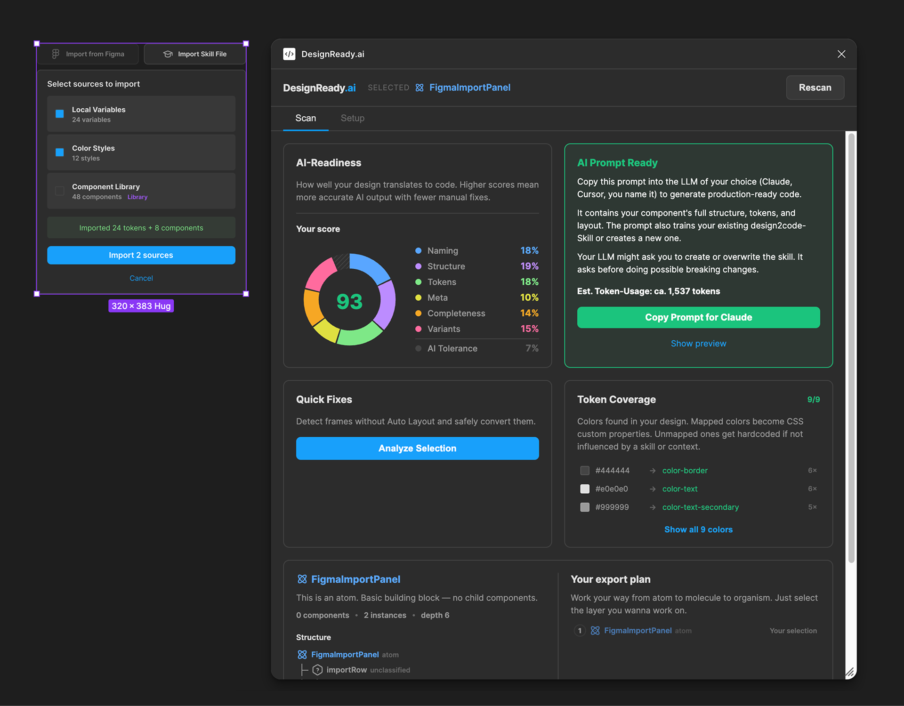

# DesignReady.ai — Figma Plugin

**AI-Readiness Scoring & Prompt Generation for Figma Components**

Score your Figma designs for AI-readiness, fix common issues, and generate structured code prompts. Each prompt trains a reusable skill for your design system.



## Quick Start

```bash
git clone https://github.com/designready-ai/designready-ai.git
cd designready-ai
npm install
npm run build
```

Then load in Figma:
1. Open Figma Desktop
2. Go to **Plugins → Development → Import plugin from manifest**
3. Select the `manifest.json` from this repo
4. Run "DesignReady.ai" from the Plugins menu

## Features

- **6-Dimension Scoring** — Naming, Structure, Tokens, Meta, Completeness, Variants
- **Compact Prompt** — Token-optimized prompt with full component spec, self-check block, and state hints
- **Skill Sync** — Prompts instruct Claude to automatically create and maintain a design system skill file that improves with every scan
- **Design System Profiles** — Import tokens from Figma Variables, Paint Styles, or local components
- **Batch Mode** — Analyze multiple components with atomic build order (atoms → molecules → organisms)
- **Auto Layout Fix** — Confidence-based analysis + one-click apply (bottom-up, skips icons/overlaps). Frames below 60% confidence are listed as skipped with the reason (inconsistent spacing, ambiguous direction, overlapping children).
- **Quick Fixes** — Auto-rename generic layers, convert dividers, delete hidden/empty nodes
- **Atomic Detection** — Classifies components as atom/molecule/organism with dependency tree and build order
- **Responsive Detection** — Auto-detect viewport variants from sibling frames. Matches name suffixes like `-mobile`, `-tablet`, `-desktop`, `-xs`/`-sm`/`-md`/`-lg`/`-xl`/`-2xl`/`-3xl`, and common widths (`-375`, `-768`, `-1024`, `-1280`, `-1440`, etc.)
- **Prompt Injection Protection** — Layer names and text content are sanitized before embedding

## Usage

### Recommended Workflow

1. **Set up a Profile** (Setup tab) — Create a Design System Profile and import your tokens from Figma Variables. This gives the prompt context about your design system.
2. **Scan a component** — Select a frame or component in Figma, click "Scan Component". Fix any issues the scoring highlights.
3. **Copy the prompt** — Once score is 75+, copy the prompt and paste it into Claude. The prompt contains everything Claude needs to generate the code.
4. **Skill Sync kicks in** — Claude will ask to create or update a skill file for your design system. Approve it. From now on, every scan makes the skill smarter.
5. **Batch for multiple components** — Select several components, use "Batch Scan". You get a single prompt with atomic build order (atoms first, then molecules, then organisms).

### Figma Best Practices for Better Scores

The better your Figma file is structured, the better the generated code will be.

**Naming (18%)**
- Give layers semantic names: `hero-title`, `product-image`, `nav-link` — not `Frame 47` or `Group 12`
- Component instances are named automatically — focus on custom frames and groups

**Structure (22%)**
- Use Auto Layout everywhere. Frames without Auto Layout become absolute-positioned in code.
- Keep nesting depth reasonable (<8 levels). Deep nesting creates unnecessary div soup.
- Use Figma's layout grids for column structures.

**Tokens (18%)**
- Bind colors to Figma Variables whenever possible. Bound colors become CSS custom properties automatically.
- Use a consistent spacing scale (4, 8, 12, 16, 24, 32). Irregular spacing lowers the score.
- Avoid one-off hex values — they can't be mapped to tokens.

**Meta (12%)**
- Delete hidden layers before scanning. They add noise to the prompt.
- Remove empty frames with no visual function.
- Set viewport-appropriate frame widths (375/428 mobile, 768/1024 tablet, 1280+ desktop).

**Completeness (15%)**
- Add variant properties to components: `state` (default, hover, active, disabled), `size` (sm, md, lg).
- The more states you define in Figma, the more complete the generated code will be.

**Variants (15%)**
- Use consistent property names: `size`, `state`, `variant` — not `Prop1`, `Property 1`.
- Cover at least default + hover + disabled states for interactive components.

### Component Descriptions

Figma component descriptions flow directly into the prompt as behaviour context. The more useful the description, the better the code.

A good component description includes:
```
Weather widget showing current conditions.

States: default, loading, error, empty
Responsive: stacks vertically below 320px
A11y: role="region" aria-label="Weather for {location}"
```

Even a one-liner helps: `Primary action button with loading state`.

### Batch Scan Strategy

Batch Scan analyzes multiple selected components and generates a single prompt with atomic build order. This is the most powerful feature for generating entire component libraries.

**Strategy:**
1. Select 5–10 components from your design system (mix of atoms and molecules)
2. Run Batch Scan — components are sorted by complexity (atoms first)
3. Copy the batch prompt — Claude builds atoms, then composes them into molecules/organisms
4. Review the generated code and approve the skill update

**Token cost awareness:** A batch prompt with 8 components generates ~10,000–18,000 input tokens. Check the token estimate shown next to the copy button before pasting.

### Atomic Design in Figma

DesignReady.ai classifies components using [Brad Frost's Atomic Design](https://bradfrost.com/blog/post/atomic-web-design/) methodology. Understanding these levels helps you structure your Figma file for the best results.

**The 5 levels:**

```
Atoms → Molecules → Organisms → Templates → Pages
```

DesignReady.ai covers Atoms through Organisms. Templates and Pages are layout concerns handled by your code framework.

**How DesignReady.ai classifies:**

| Level | Definition | Example | How it's detected |
|-------|-----------|---------|-------------------|
| **Atom** | Smallest functional unit. No child components. | Button, Icon, Badge, Input | Component with 0 component children |
| **Molecule** | Simple group of atoms working together. | SearchBar (Input + Button + Icon), ProductCard (Image + Title + Price + Badge) | Contains only atoms (leaf components) |
| **Organism** | Complex section containing molecules and/or atoms. | Header (Logo + NavBar + SearchBar), ProductGrid (ProductCard × n) | Contains at least one molecule (a child that itself contains components) |
| Unclassified | Raw frame, not a component. | A wrapper frame without component structure | Not a Component or Instance |

**Key insight:** A ProductCard with 5 atoms (Image, Title, Price, Badge, Button) is a **Molecule**, not an Organism — because all its children are atoms. An Organism only appears when a child component itself contains other components.

**Structuring your Figma file:**

```
Page (don't scan this)
├── Header (Organism)        ← scan this
│   ├── Logo (Atom)
│   ├── Navigation (Molecule)
│   │   ├── NavItem (Atom) × 5
│   │   └── Dropdown (Atom)
│   └── SearchBar (Molecule)
│       ├── Input (Atom)
│       └── Button (Atom)
├── ProductGrid (Organism)   ← or scan this
│   └── ProductCard (Molecule) × 12
│       ├── Image (Atom)
│       ├── Title (Atom)
│       └── PriceTag (Atom)
└── Footer (Organism)        ← or scan this
```

**Best practices:**
- Build atoms as standalone Figma Components first (Button, Icon, Badge, Input)
- Compose molecules from atom instances (SearchBar = Input + Button + Icon)
- Compose organisms from molecule + atom instances (Header = Logo + Nav + SearchBar)
- Scan at the organism level or below — never scan entire pages
- Use Batch Scan to select all organisms on a page → get the full build order in one prompt
- A typical page has 5–8 organisms — that's normal, not a problem
- Each organism should be its own Figma Component or clearly named Frame

### ComponentSet Variants

When you select a ComponentSet, DesignReady.ai scans the **Default variant** as a full layout tree and adds the other variants as metadata only — a list of available properties and their values (e.g. `variants(state:[default|hover|disabled] size:[sm|md|lg])`). Claude is instructed to implement state-like properties as CSS pseudo-classes.

**This works well for:**
- `state=hover | focus | active | disabled | pressed` — pure styling differences
- `size=sm | md | lg` with linearly scaled padding and typography
- Color-only variants (`variant=primary | secondary | ghost`)

**This misses structural differences:**
- `state=loading` with an added spinner node
- `state=error` with an extra error icon and message
- `state=empty` with a completely different layout

For structurally different variants, **select each variant individually** in the ComponentSet and run **Batch Scan**. Every selected variant becomes its own full tree in the batch prompt, so Claude sees the layout differences directly.

### Profile Tips

- **Import from Figma first** — Variables and Paint Styles import automatically. This gives you tokens without manual entry.
- **Add your tech stack** — `React + TypeScript + Tailwind` or `Vue 3 + Nuxt` — the prompt adapts.
- **Add guidelines** — "BEM naming", "dark-first theming", "8px grid" — these flow into the prompt's rules section.
- **One profile per design system** — If you work across multiple projects, create separate profiles.

## Performance Guidelines

DesignReady.ai works best with individual components, not entire pages.

| Selection | Nodes | Performance |
|-----------|:-----:|-------------|
| Single component (Button, Card) | <100 | Instant |
| Complex component (Header, Hero) | 100–500 | Fast (<2s) |
| Large organism (Page section) | 500–1000 | Slower (5–10s) |
| Full page or multiple large frames | 1000+ | Not recommended |

**Tips:**
- Scan individual components, not entire pages
- Use Batch Scan for multiple small components (atoms first)
- Large organisms: scan sub-components individually, then batch
- If a scan takes >5s, select a smaller subtree

## Getting Started

### Install Dependencies

```bash
npm install
```

### Development

```bash
npm run dev       # Watch mode (rebuilds on changes)
```

Load the plugin in Figma:
1. Plugins → Development → Import plugin from manifest
2. Select `manifest.json` from this repo
3. Run the plugin from Plugins menu

### Build

```bash
npm run build     # Production build
npm run package   # Release package
```

### Test & Lint

```bash
npm test              # Run tests (Vitest)
npm run test:coverage # With coverage report
npm run lint          # ESLint
npm run format        # Prettier
```

## Architecture

```
plugin/              → Figma Sandbox (no DOM, no window)
  ├── code.ts        → Message router
  └── handlers/      → Domain handlers (selection, profiles, fixes, figma-import, autolayout)

ui/                  → React 19 in iframe (no figma.* access)
  ├── App.tsx        → Root: 2 tabs (Scan | Setup)
  ├── components/    → Score, Fixes, Prompt, Batch, Profile, TokenMap, AtomicBadge
  ├── hooks/         → useSelection, useScan, useProfiles, useBatchScan
  └── lib/           → Scoring modules, prompt generator, atomic detection, utilities

shared/              → Types + constants, imported by both sides
  └── types.ts       → SerializedNode, PluginMessage, SCORE_WEIGHTS, etc.
```

Communication between Plugin and UI is exclusively via `postMessage` with a typed `PluginMessage` discriminated union.

## Scoring System

| Dimension | Weight | What it checks |
|-----------|--------|----------------|
| Naming | 18% | Semantic vs generic layer names |
| Structure | 22% | Auto Layout usage, nesting depth, grids |
| Tokens | 18% | Color binding, palette consistency, spacing grid |
| Meta | 12% | Hidden layers, empty frames, viewport detection |
| Completeness | 15% | Component states, variant properties |
| Variants | 15% | Size variants, state coverage, property naming |

Prompts are generated when score reaches **75+** (60+ average for batch prompts).

## Skill Sync

When a Design System Profile is active, every prompt includes a `# TASK 2 — Skill Sync` block that instructs Claude to:

1. Check if a skill file exists for your design system
2. If not — ask to create one from the profile context
3. If yes — compare tokens and components, suggest updates
4. Maintain a clean structure: skill file (<150 lines) + reference files for tokens and individual components

This means every scan can improve your design system skill — without manual maintenance.

## Stack

- **Plugin:** TypeScript, esbuild
- **UI:** React 19, TypeScript, Vite (singlefile build)
- **Styling:** CSS with Dark Theme (Figma-native tokens)
- **Testing:** Vitest + @vitest/coverage-v8 (105 tests)
- **Linting:** ESLint 9 + Prettier

## License

MIT — see [LICENSE](LICENSE)
